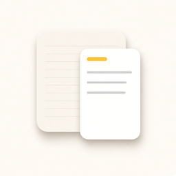

# Chenggao



Obsidian desktop plugin. Keep writing Markdown on the left; preview Notes-style cards or a WeChat article on the right. Edits update the preview as you type.

中文说明见 [README.zh.md](README.zh.md). The in-app UI follows the Obsidian language (Chinese when it starts with `zh`, otherwise English).

- **Cards**: paginated iPhone 17 screenshot size (1206×2622)
- **Article**: WeChat-style preview you can copy into the official editor
- **Export**: PNGs go to a sibling `图片/` folder; article HTML can be saved as `.wechat.html`

## Install

Until it is listed in the community directory, install from this repository.

Build:

```bash
git clone https://github.com/RYYAI/Chenggao.git
cd Chenggao
npm install
npm run build
```

Copy these files into your vault:

```
.obsidian/plugins/chenggao/
  manifest.json
  main.js
  styles.css
```

Then enable **Chenggao** under **Settings → Community plugins**. Details: [install](docs/install.md).

## Usage

1. Open a Markdown note
2. Click the Chenggao ribbon icon, or run **Chenggao: Open layout preview**
3. Switch **Cards** or **Article** in the preview
4. Edit the note; the preview refreshes automatically

| Command | What it does |
| --- | --- |
| Open layout preview | Open preview beside the current note |
| Copy WeChat article format | Copy WeChat-ready rich text |
| Export images next to the note | Export PNG pages or a long image |

Right-click a note title and choose **Open with Chenggao**. More: [usage](docs/usage.md).

## Export paths

Relative to the current note:

| Output | Path |
| --- | --- |
| Card page N | `图片/<note>-01.png` |
| Article image | `图片/<note>-长文.png` |
| WeChat HTML | `<note>.wechat.html` |

Desktop only.

## Develop

```bash
npm install
npm run dev
```

Source lives in `src/`. Reload the plugin after a rebuild. See [develop](docs/develop.md).

## License

[MIT](LICENSE)
