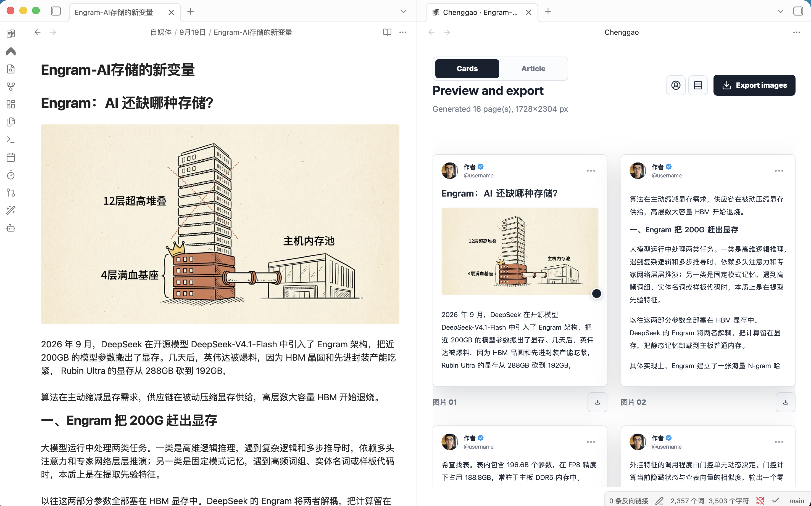
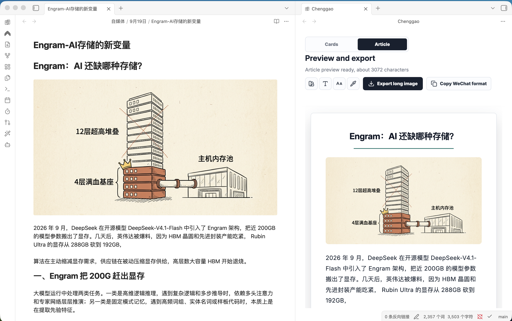

# 成稿预览（Chenggao）

Obsidian 桌面端插件。左侧继续用 Obsidian 编辑 Markdown，右侧预览推特样式卡片或公众号长文；改笔记时预览跟着更新。

英文说明见根目录 [README.md](README.md)。

## 预览

左侧继续用 Obsidian 写笔记，右侧预览会跟着更新。

**图文卡片**按推特信息流分页。

**长文**是公众号样式预览，可复制到公众号编辑器。

## 安装

见 [安装说明](docs/zh/install.md)。插件目录必须是 `.obsidian/plugins/chenggao/`。

## 使用

见 [使用说明](docs/zh/usage.md)。

命令面板里，若 Obsidian 界面语言为中文，命令显示为「打开排版预览」等；英文界面则显示 `Open layout preview`。

插件只在桌面端运行，不需要账号，也不会访问远程服务器。复制公众号格式会用系统剪贴板；导出只写入当前库。
